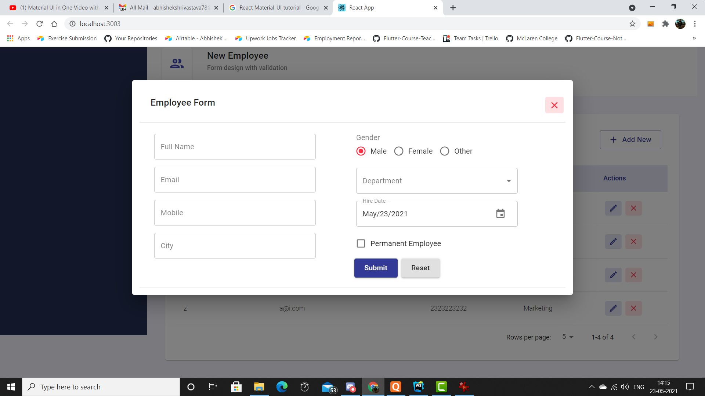

# Employee Registration With Material UI 
Implement a ReactJS App using Material UI library for Employee Registration with Validation.

- Please find the attached screenshots and the demonstation video to understand the Functionality.

- Please find the link to download the demo video

[video](https://drive.google.com/drive/folders/1K18g7h5lH8O4-DoVaFtPEddlcJD_bXD0?usp=sharing)

- You can use local storage to store the employee records

